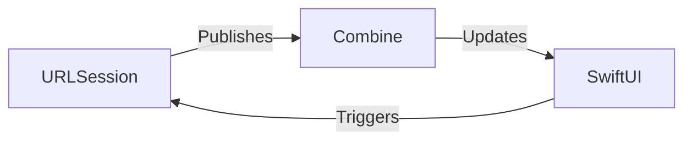

# 📡 Combine + SwiftUI Networking Explained

A minimalist guide to understanding how Combine, SwiftUI, and URLSession work together to manage networking in modern iOS apps.

## 🔗 How It All Works Together

### The Core Trio

1. **`URLSession`** – Performs actual network requests  
2. **`Combine`** – Manages asynchronous data streams  
3. **`SwiftUI`** – Reactively updates the UI based on published data  



## 🧩 Component Breakdown

### 1. URLSession's Role

```swift
// Creates a Combine publisher for network requests
URLSession.shared.dataTaskPublisher(for: url)
    .map(\.data) // Extract raw data
    .decode(type: Model.self, decoder: JSONDecoder()) // Decode JSON into Swift model
```

### 2. Combine's Magic

| Component   | Purpose                | Example                |
|------------|------------------------|------------------------|
| Publisher  | Emits values over time | `dataTaskPublisher`    |
| Operators  | Transforms data        | `.map`, `.decode`, `.catch` |
| Subscriber | Receives final output  | `.sink`                |

### 3. SwiftUI Integration

```swift
class ViewModel: ObservableObject {
    @Published var data: [Model] = []
}

struct ContentView: View {
    @StateObject var vm = ViewModel()
    
    var body: some View {
        List(vm.data) { item in
            Text(item.name)
        }
    }
}
```

## 🔄 Complete Data Flow

1. User performs action (e.g., view appears)  
2. ViewModel makes the network call:

```swift
URLSession.shared.dataTaskPublisher(for: url)
    .map(\.data)
    .decode(type: [Model].self, decoder: JSONDecoder())
    .receive(on: DispatchQueue.main)
    .sink(receiveCompletion: { _ in }, receiveValue: { [weak self] data in
        self?.data = data
    })
    .store(in: &cancellables)
```

3. `@Published` triggers SwiftUI to refresh the UI automatically.

## 🛡 Error Handling Example

```swift
.catch { error in
    switch error {
    case is URLError:
        return Just(placeholderData)
    default:
        return Empty()
    }
}
```

## 🏆 Key Benefits

- ✅ **Automatic UI updates** when data changes  
- ✅ **Clean separation** of networking and UI logic  
- ✅ **Built-in async handling** using Combine  
- ✅ **Type-safe decoding** from JSON to Swift models  

## ✅ Summary

This architecture enables clean, reactive, and testable networking in SwiftUI using Combine. Ideal for modern, data-driven apps.

## ✨ Key Features of This Guide

- Visual flowchart using Mermaid  
- Code + explanation layout  
- Practical, real-world SwiftUI + Combine usage  
- Minimalist, concept-focused design  
- No boilerplate, no setup clutter

> Want an advanced version using async/await instead of Combine? Let me know!
